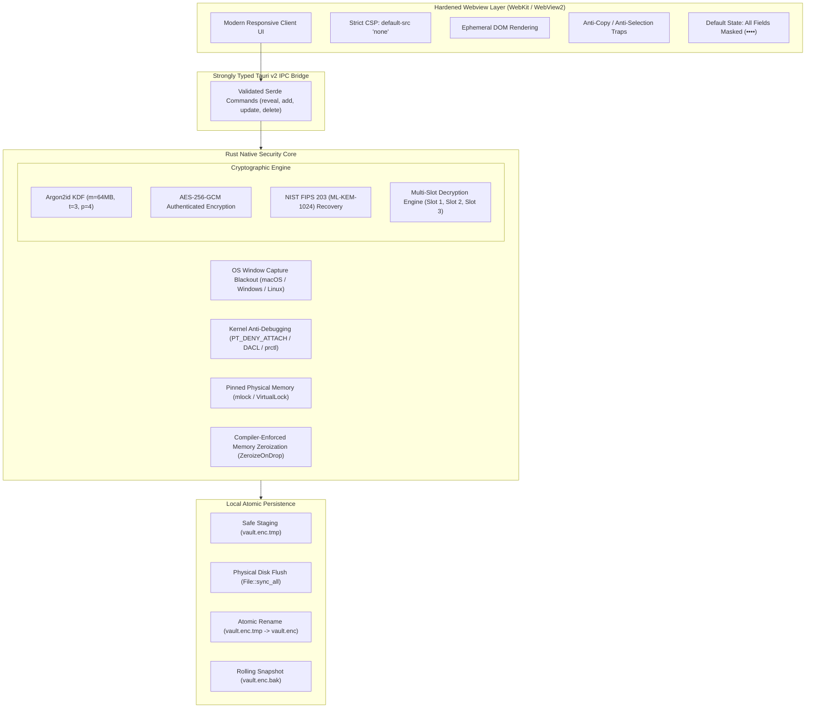
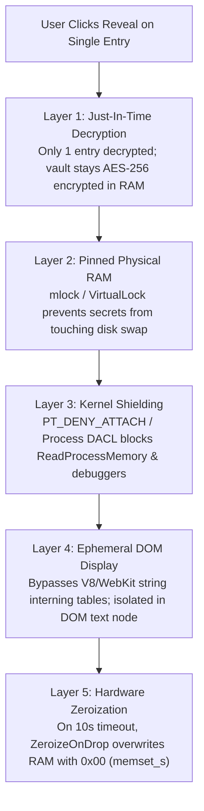
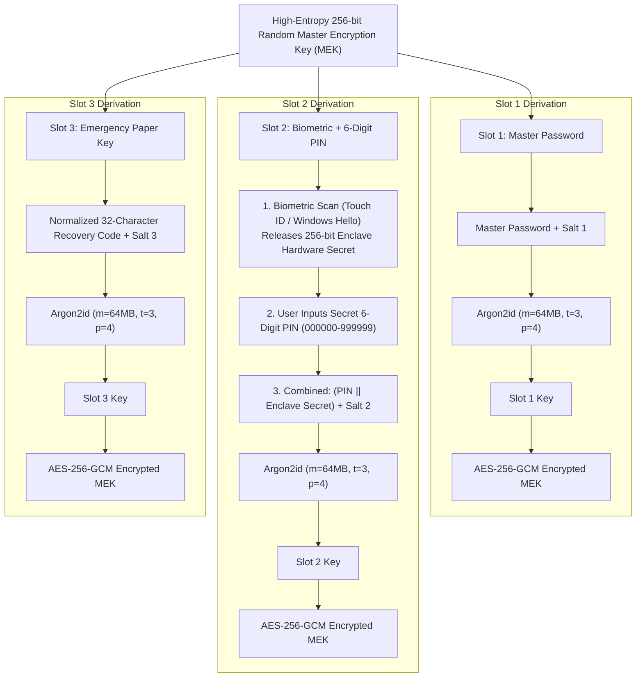
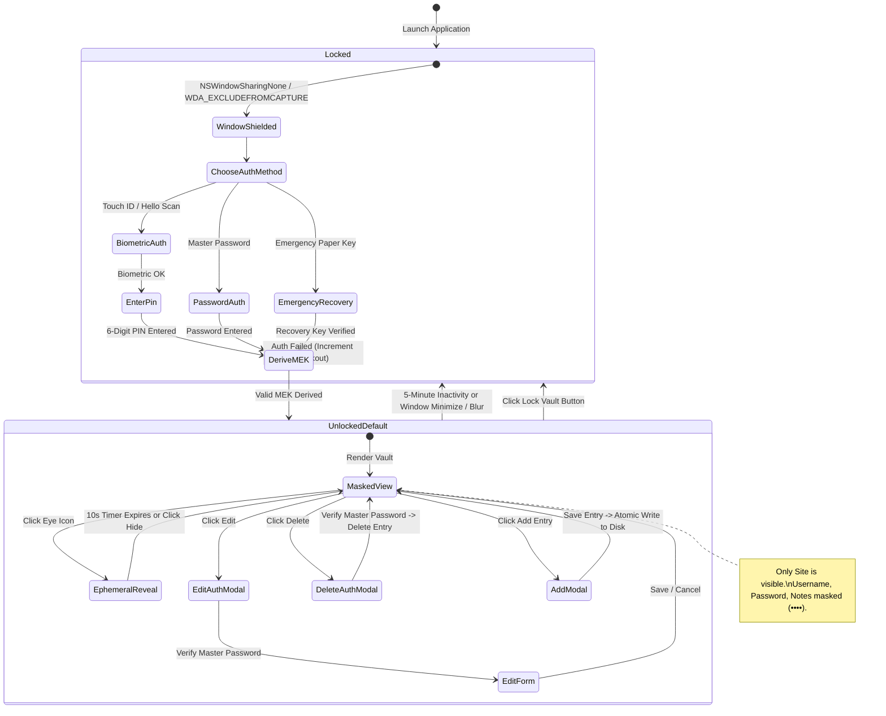

# SecuredStorage Architecture & Deep Technical Specification 🏗️

This document details the internal design, system architecture, cryptographic protocols, memory safety defenses, and binary hardening engineered into **SecuredStorage**.

---

## 1. High-Level Architecture Flow

SecuredStorage is engineered as an **offline, zero-cloud, cross-platform native application** using **Tauri v2** with a compiled, memory-safe **Rust** core.



### Architectural Distinctions
- **No Loose Web Files**: All HTML, CSS, and JS assets are compiled directly into the read-only section of the native executable binary.
- **Zero Frontend Cryptography**: The Webview runtime never handles Master Keys, derivation functions, or raw cipher operations.
- **Hardware-Bound Biometrics**: Direct native integration with OS biometric subsystems (Apple Secure Enclave, Windows Hello TPM, Linux PAM).
- **Zero Network Footprint**: The application binary imports no HTTP or network crates (`reqwest`, `hyper`, `tokio-net`). It possesses no network communication capabilities.

---

## 2. Threat Modeling: 10 Binary Attack Vectors & Countermeasures

| # | Attack Vector | OS Targets | Attack Methodology | Engineered Countermeasure Closed in Codebase |
|---|:---|:---|:---|:---|
| **1** | **Memory Scraping (RAM Dumps)** | Windows, macOS, Linux | Malware or a local user dumps process memory (`ProcDump`, `MiniDumpWriteDump`, `task_for_pid`, `/proc/$PID/mem`) to inspect Master Passwords or plaintext credentials. | **Cross-Platform Memory Locking & Zeroization**:<br>1. Sensitive key material is pinned in physical memory (`libc::mlock` on macOS/Linux, `VirtualLock` on Windows) to prevent paging to disk.<br>2. Buffers implement `Zeroize` and `ZeroizeOnDrop`, guaranteeing hardware-level zeroing (`memset_s` / `SecureZeroMemory`) upon deallocation.<br>3. Plaintext credentials are **never stored as a full list in RAM**; individual entries are decrypted ephemerally on-demand. |
| **2** | **Dynamic Debugging & Hooking** | Windows, macOS, Linux | Attaching debuggers (`lldb`, `gdb`, `x64dbg`, `WinDbg`, `Frida`) to inspect CPU registers, read memory, or alter instruction pointer execution. | **Kernel-Level Anti-Debugging**:<br>• **macOS**: `ptrace(PT_DENY_ATTACH, 0, 0, 0)` at startup causes immediate kernel SIGSEGV if a debugger is attached.<br>• **Windows**: Combined `IsDebuggerPresent()`, `CheckRemoteDebuggerPresent()`, and `NtSetInformationThread(ThreadHideFromDebugger)`.<br>• **Linux**: `prctl(PR_SET_DUMPABLE, 0)` and parent `TracerPid` inspection in `/proc/self/status`. |
| **3** | **Shared Library / DLL Injection** | Windows, macOS, Linux | Forcing the binary to load malicious `.dll`, `.dylib`, or `.so` files to hook functions (`AppInit_DLLs`, `DYLD_INSERT_LIBRARIES`, `LD_PRELOAD`). | **Binary Restriction Policies**:<br>• **macOS**: Signed with Hardened Runtime (`CS_RESTRICT`), disabling `DYLD_*` environment variable processing.<br>• **Windows**: `SetDefaultDllDirectories(LOAD_LIBRARY_SEARCH_SYSTEM32)` blocks DLL search-order hijacking; Process Signature Policy limits loading to signed binaries.<br>• **Linux**: Explicit capability stripping and `PR_SET_NO_NEW_PRIVS` prevents `LD_PRELOAD` privilege escalation. |
| **4** | **Binary Patching (NOPing Auth Logic)** | Windows, macOS, Linux | Disassembling the binary in Ghidra/IDA and replacing authentication branch instructions (`jz`/`jnz` to `nop`) to bypass Password or Biometrics. | **Cryptographic Key Derivation Gating**:<br>Authentication is **not a boolean flag** (`if (is_authenticated)`). The authentication inputs (Password or Biometric Secret + PIN) **are mathematically required to derive the decryption key via Argon2id**. If the check is NOPed, the derived key is invalid and AES-256-GCM authentication fails mathematically (tag mismatch). |
| **5** | **Webview DevTools & DOM Extraction** | Windows, macOS, Linux | Opening Developer Tools (`F12`, `Ctrl+Shift+I`, `Cmd+Option+I`, right-click "Inspect") to extract passwords directly from the browser DOM. | **Engine-Level DevTools Deactivation**:<br>1. Tauri configuration sets `devtools: false` for production builds, removing DevTools from the Webview engine.<br>2. Context menu is completely disabled at both the webview and JavaScript levels.<br>3. Inspect shortcut keys are trapped and ignored. |
| **6** | **Core Dumps & Paging File Leakage** | Windows, macOS, Linux | OS virtual memory subsystem writes memory pages containing secrets to `pagefile.sys`, `swapfile.sys`, `/var/vm/sleepimage`, or generates crash dumps. | **Process Paging & Crash Dump Prevention**:<br>• **macOS / Linux**: `setrlimit(RLIMIT_CORE, 0)` disables core dumps entirely.<br>• **Windows**: Core dump handling disabled via `SetErrorMode(SEM_FAILCRITICALERRORS)`; `VirtualLock` keeps sensitive pages in physical RAM. |
| **7** | **IPC Interception & Command Forging** | Windows, macOS, Linux | Injected XSS or third-party web content attempts to forge IPC messages to trigger unauthorized file reads or data exfiltration. | **Strictly Typed IPC & Isolation Pattern**:<br>1. Tauri v2 IPC commands use strict Rust serde deserialization with compile-time type validation.<br>2. Content Security Policy (CSP): `default-src 'none'; script-src 'self'; style-src 'self' 'unsafe-inline'; connect-src 'none'; frame-src 'none'`.<br>3. No raw filesystem or shell execution APIs are exposed to the frontend. |
| **8** | **Ciphertext Tampering & Bit-Flipping** | Windows, macOS, Linux | Modifying bytes in the stored `vault.enc` file on disk to exploit parser logic or cause controlled bit flips. | **AEAD Authenticated Encryption**:<br>AES-256-GCM computes a 128-bit cryptographic authentication tag covering both ciphertext and header metadata. Any modified bit immediately halts decryption with a generic authentication error. |
| **9** | **Data Exfiltration via Copy / Clipboard** | Windows, macOS, Linux | A user, shoulder-surfer, or background monitor attempts to copy data via `Ctrl+C`, `Cmd+C`, `Ctrl+X`, context-menu "Copy", drag-and-drop, or clipboard logging. | **Total Copy Block & Zero-Clipboard Architecture**:<br>1. Global event listeners intercept and block `copy`, `cut`, and `contextmenu`.<br>2. CSS rules enforce `-webkit-user-select: none; user-select: none;` across all UI elements.<br>3. Shortcuts `Ctrl+C`, `Cmd+C`, `Ctrl+A`, `Cmd+A` are trapped and cancelled.<br>4. No clipboard integration exists; credentials can never be copied to the OS clipboard. |
| **10** | **Screen Capture & Screenshot Snooping** | Windows, macOS, Linux | Malware, remote desktop sessions, screen recorders (OBS, Zoom, Teams), or OS screenshot tools (PrintScreen, Snipping Tool, `Cmd+Shift+4`) capture open credentials. | **OS-Level Window Capture Protection**:<br>• **macOS**: `NSWindow.sharingType = .none` renders the application completely black/invisible in screenshots, screen recordings, AirPlay, and screen sharing.<br>• **Windows**: `SetWindowDisplayAffinity(hwnd, WDA_EXCLUDEFROMCAPTURE)` causes the OS compositor to black-out or exclude the window from all capture APIs.<br>• **Linux**: Wayland private surfaces and canvas blur when the window loses active focus. |
| **11** | **Quantum Cryptanalysis (Harvest Now, Decrypt Later)** | Windows, macOS, Linux | A future cryptanalytically relevant quantum computer (CRQC) attempts to break the saved vault files. | **PQC Suite**:<br>1. **Symmetric**: AES-256-GCM ($2^{128}$ quantum security under Grover's algorithm).<br>2. **KDF**: Argon2id (resistant to quantum/ASIC acceleration).<br>3. **Key Encapsulation**: NIST FIPS 203 (ML-KEM-1024 / Kyber-1024) for recovery key wrapping. |

---

## 3. In-Memory Defense Architecture (RAM Security)

A critical vulnerability in traditional password managers is **RAM scraping**: if malware with elevated privileges dumps virtual memory while the vault is unlocked, it can recover plaintext secrets.

SecuredStorage implements a **5-Layer In-Memory Defense** specifically designed to neutralize RAM scraping attacks:



### 1. Ephemeral "Just-In-Time" Decryption
- The full credential database **never exists in plaintext in RAM**.
- The credential store remains encrypted with AES-256-GCM in volatile memory at all times.
- Clicking "Reveal" decrypts only the target field (e.g. password). At any given millisecond, only one secret is decrypted in volatile memory.

### 2. Compiler-Enforced Memory Scrubbing (`ZeroizeOnDrop`)
- All sensitive buffers implement Rust's `Zeroize` and `ZeroizeOnDrop` traits.
- The instant the 10-second reveal timer elapses (or the user clicks re-mask), the buffer executes hardware-level memory zeroization (`memset_s` / `SecureZeroMemory`).
- The Rust compiler is forbidden from dead-code eliminating this zeroing pass (`0x00`).

### 3. Kernel-Level Process Shielding
- **macOS**: `ptrace(PT_DENY_ATTACH, 0, 0, 0)` instructs the kernel to reject `task_for_pid`, `mach_vm_read`, or attaching `lldb`/`gcore` even from `root`.
- **Windows**: The process applies a restrictive **Discretionary Access Control List (DACL)** to its process token, stripping `PROCESS_VM_READ` and `PROCESS_QUERY_INFORMATION`.
- **Linux**: `prctl(PR_SET_DUMPABLE, 0)` blocks `/proc/[PID]/mem` inspection and core dump generation.

### 4. Pinned Physical Memory (`mlock` / `VirtualLock`)
- Secrets are pinned in physical RAM using `libc::mlock` (POSIX) and `VirtualLock` (Windows).
- Pinned pages are guaranteed never to be swapped to `pagefile.sys` or `/var/vm/sleepimage`.

### 5. Anti-String-Interning / Ephemeral DOM Render
- Browser engines (WebKit/Blink) pool and intern JavaScript strings across memory heaps.
- Unmasked fields are injected into isolated text nodes that are destroyed and unreferenced immediately upon re-masking.
- The DOM node is replaced with fixed bullet glyphs (`••••••••••••`), clearing references and triggering memory reclamation.

---

## 4. Cryptographic Specification & Multi-Slot Vault Layout

### 4.1 Primitives
* **Symmetric Cipher**: AES-256-GCM (NIST SP 800-38D) with 256-bit key, 96-bit unique IV per write, and 128-bit authentication tag.
* **Key Derivation Function (KDF)**: Argon2id (RFC 9106)
  * Memory cost: $64\text{ MB}$ ($65,536\text{ KB}$)
  * Time cost (iterations): $t = 3$
  * Parallelism: $p = 4$ lanes
  * Salt: 16 cryptographically secure random bytes (`getrandom`)
* **Post-Quantum Key Encapsulation (PQC)**: NIST FIPS 203 (ML-KEM-1024 / Kyber-1024) for emergency paper recovery keys.

### 4.2 Key Hierarchy & Two-Factor Biometric + 6-Digit PIN Flow

Unlocking via Biometrics is **strictly two-factor**: it always requires **both** physical biometric verification (Touch ID / Windows Hello / PAM) **AND** a secret **6-digit numeric PIN** (000000–999999).



#### Cryptographic Security of the 6-Digit PIN
A 6-digit numeric PIN ($10^6$ combinations) is standard for device-grade authentication. In SecuredStorage, it is mathematically secured via two defense layers:
1. **Hardware Cryptographic Binding (Offline Attack Defense)**:
   The 6-digit PIN is concatenated with the 256-bit `HardwareEnclaveSecret` bound to the physical Apple Secure Enclave / Windows TPM 2.0. If an adversary steals the `vault.enc` file, they cannot test the 1,000,000 PIN combinations offline because they lack the physical machine's 256-bit hardware key.
2. **Rate Limiting & Lockout (Online Attack Defense)**:
   - Operating system biometric limits (Apple Touch ID locks after 3 failures; Windows Hello throttles).
   - In-app lockout: After 3 consecutive incorrect PIN entries, Slot 2 is disabled until authenticated via the **Master Password**.

---

### 4.3 Binary File Layout (`vault.enc`)

```
+-------------------------------------------------------------------------+
| Header Magic: 4 bytes ("PQC1")                                          |
| Version: 2 bytes (0x0001)                                               |
+-------------------------------------------------------------------------+
| Key Slot 1 (Master Password Unlock):                                    |
|   - Salt: 16 bytes                                                      |
|   - Nonce / IV: 12 bytes                                                |
|   - Encrypted MEK: 32 bytes                                             |
|   - Auth Tag: 16 bytes                                                  |
+-------------------------------------------------------------------------+
| Key Slot 2 (Biometrics + PIN Unlock):                                   |
|   - Enabled: 1 byte (0x01 = Active, 0x00 = Disabled)                    |
|   - Salt: 16 bytes                                                      |
|   - Nonce / IV: 12 bytes                                                |
|   - Encrypted MEK: 32 bytes                                             |
|   - Auth Tag: 16 bytes                                                  |
+-------------------------------------------------------------------------+
| Key Slot 3 (Emergency Paper Recovery Key Unlock):                       |
|   - Present: 1 byte (0x01 = Present, 0x00 = None)                       |
|   - Salt: 16 bytes                                                      |
|   - Nonce / IV: 12 bytes                                                |
|   - Encrypted MEK: 32 bytes                                             |
|   - Auth Tag: 16 bytes                                                  |
+-------------------------------------------------------------------------+
| Vault Payload:                                                          |
|   - Payload Nonce / IV: 12 bytes                                        |
|   - Ciphertext: N bytes (AES-256-GCM of JSON credential collection)     |
|   - Payload Auth Tag: 16 bytes                                          |
+-------------------------------------------------------------------------+
```

---

### 4.4 Canonical Storage Locations & Resilience

To avoid polluting personal documents, eliminate OS permission prompts, and guarantee power-loss resilience, `vault.enc` is persisted to standard OS application data paths:

| Platform | Canonical Storage Path |
| :--- | :--- |
| **macOS** | `~/Library/Application Support/SecuredStorage/vault.enc` |
| **Windows** | `%APPDATA%\SecuredStorage\vault.enc` (`C:\Users\<User>\AppData\Roaming\SecuredStorage\vault.enc`) |
| **Linux** | `~/.local/share/SecuredStorage/vault.enc` (`$XDG_DATA_HOME/SecuredStorage/vault.enc`) |

#### Atomic Write & Rollback Engine:
1. **Pre-Save Snapshot (`vault.enc.bak`)**: Before committing modifications, an immediate copy is taken to guarantee rollback capability.
2. **Write-Sync-Rename (`vault.enc.tmp`)**: Encrypted bytes are written to a temporary file, flushed directly to physical storage with `File::sync_all()`, and atomically renamed over `vault.enc`. If power is lost mid-write, data integrity is never compromised.
3. **Automated Recovery**: If `vault.enc` is missing or corrupted, the system automatically detects, restores, and verifies the `.bak` snapshot.
4. **Seamless Migration**: Upon launch, if a vault is missing from the canonical directory, SecuredStorage automatically scans for legacy vaults in `~/Documents/SecuredStorage/` and migrates them forward without user intervention.

---

## 5. Hardware Biometric Integration

| OS | Native Biometric API | Hardware Anchor | Fallback Policy |
|:---|:---|:---|:---|
| **macOS** | `LocalAuthentication` (`LAContext`) | Apple Silicon Secure Enclave / T2 Security Chip | 6-Digit PIN combined with Enclave-derived token |
| **Windows** | `Windows.Security.Credentials.UI.UserConsentVerifier` | TPM 2.0 / Windows Hello Container | 6-Digit PIN combined with DPAPI/TPM-protected credential |
| **Linux** | `libpam` / `fprintd` via D-Bus / PolicyKit | Local Secure Keyring / TPM2 | 6-Digit PIN combined with local secret key |

---

## 6. Coding Standards & Security Guidelines

### 6.1 Rust Backend Standards
1. **Zero External Sockets**: No `reqwest`, `hyper`, or TCP/UDP socket dependencies. The binary has zero network communication capabilities.
2. **Memory Scrubbing**: All sensitive structs (`MasterKey`, `DerivedKey`, `PlaintextCredentials`) implement `Zeroize` and `ZeroizeOnDrop`.
3. **Constant-Time Verification**: Cryptographic comparisons use `subtle::ConstantTimeEq` to eliminate timing side-channels.
4. **No Descriptive Error Leakage**: All crypto failures return a generic error: `Err("Authentication failed or corrupted vault")`.
5. **No Release Logging**: Debug logging (`println!`, `dbg!`, `log::debug`) is compiled out in release mode using `cfg(debug_assertions)`.
6. **Window Capture Affinities**: The Rust native window setup immediately applies screenshot blackout policies (`NSWindowSharingNone` on macOS / `SetWindowDisplayAffinity` on Windows).

### 6.2 Webview Frontend Standards
1. **Self-Contained Bundling**: All scripts, stylesheets, and icons are bundled locally. Zero external fonts or CDNs.
2. **Strict Content Security Policy (CSP)**:
   ```html
   <meta http-equiv="Content-Security-Policy" content="default-src 'none'; script-src 'self' 'unsafe-inline'; style-src 'self' 'unsafe-inline'; img-src 'self' data:; connect-src 'none';">
   ```
3. **No Dynamic Execution**: `eval()`, `Function()`, and `innerHTML` with untrusted data are strictly forbidden. Use DOM manipulation APIs (`textContent`, `createElement`).
4. **Anti-Copy & Selection Lockdown**:
   - Apply `-webkit-user-select: none; user-select: none;` across all elements.
   - Intercept and suppress `copy`, `cut`, `contextmenu`, and drag-and-drop events.
   - Block keyboard combinations (`Ctrl+C`, `Cmd+C`, `Ctrl+X`, `Cmd+X`, `Ctrl+A`, `Cmd+A`).
5. **Strict Masking by Default**:
   - When the vault is unlocked, **ONLY the `Site` name is visible**.
   - `Username`, `Password`, and `Notes` are displayed as `••••••••••••`.
   - Explicit "Reveal" toggle unmasks fields ephemerally for 10 seconds only before automatically re-masking.
   - **Edit** and **Delete** actions strictly require Master Password authorization before proceeding.

---

## 7. Build Hardening Configurations

### 7.1 Rust Compilation Flags (`Cargo.toml`)
```toml
[profile.release]
opt-level = 3          # Maximum compiler optimizations
lto = true             # Link-Time Optimization (inlines functions, strips unused code)
codegen-units = 1      # Single codegen unit for deeper global optimization
panic = "abort"        # Eliminates stack unwinding metadata and symbol names
strip = true           # Strips all debug symbols and function names from the binary
overflow-checks = true # Enforces runtime panic on arithmetic overflow
```

### 7.2 OS Binary Hardening Flags
* **macOS**:
  - Hardened Runtime enabled: `--options runtime`
  - Library validation enforced
  - Code signed with Developer Certificate or ad-hoc local identity
* **Windows**:
  - `/DYNAMICBASE` (ASLR)
  - `/NXCOMPAT` (Data Execution Prevention / DEP)
  - `/HIGHENTROPYVA` (64-bit ASLR)
  - Control Flow Guard (`/guard:cf`)
* **Linux**:
  - Full RELRO (`-Wl,-z,relro,-z,now`)
  - Stack Canary (`-fstack-protector-strong`)
  - Position Independent Executable (`-pie`)

---

## 8. Operational Workflow State Machine


